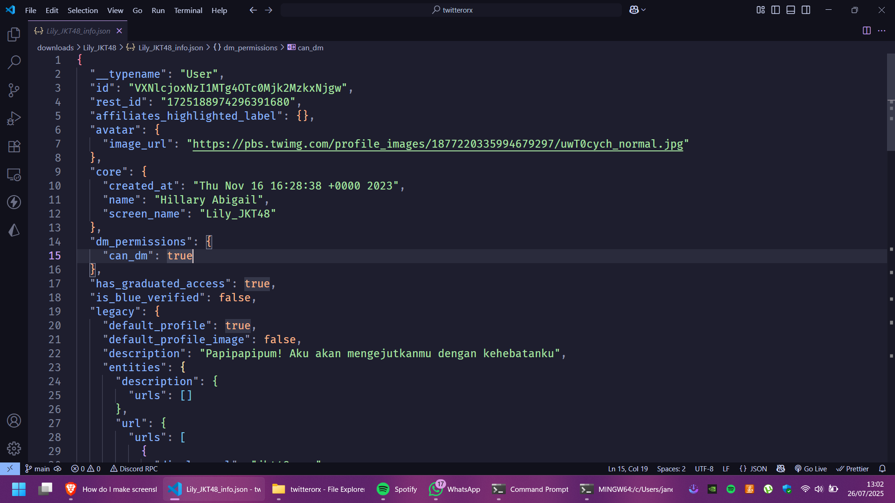
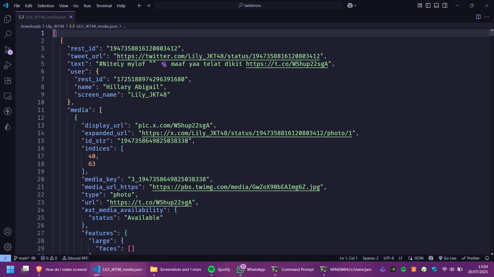

<br />
<div align="center">
  <h1 align="center"><font size="9">twitterorx</font></h1>

  <p align="center">
  An javascript project to download media from twitter
    <br />
    <a href="https://github.com/janexmgd/twitterorx"><strong>Explore the docs »</strong></a>
  </p>
</div>

### CAUTION

**Please be aware of the following risk before proceeding!**

### SET ENV

creating .env file with format this

```
TWITTER_TOKEN='Bearer Your twitter token here'
TWITTER_COOKIE='Your twitter cookie here'
```

you can obtain this from open <a href="https://x.com"><i>Twitter</i></a> with your logged account, and ctrl+shift+i and find graphql request, see at request headers

### HOW TO RUN

- Set env first
- install package

```
npm install
```

- run package

```
npm start
```

### docs

example sample output

- user info output

  []({video-url} 'user info output')

- user media output

  []({video-url} 'user media output')
